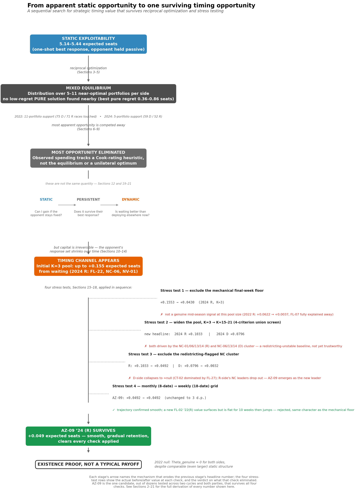
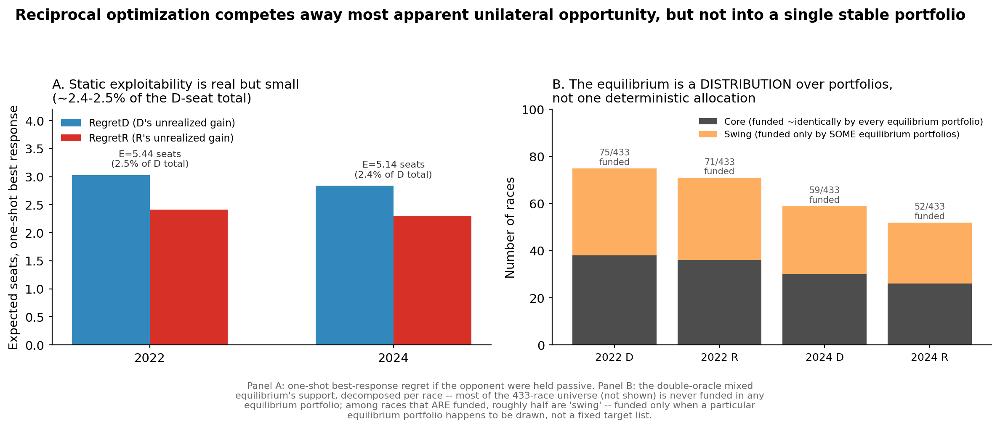
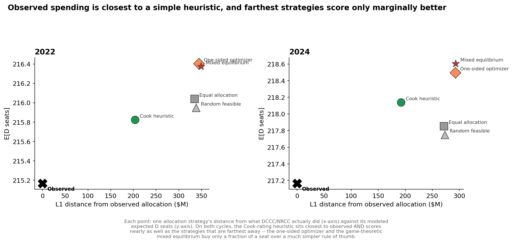
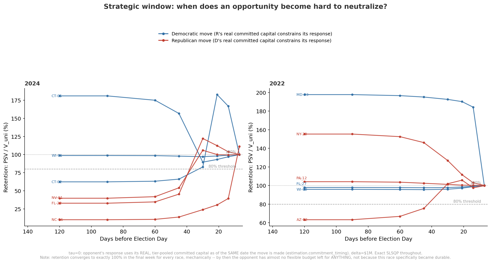
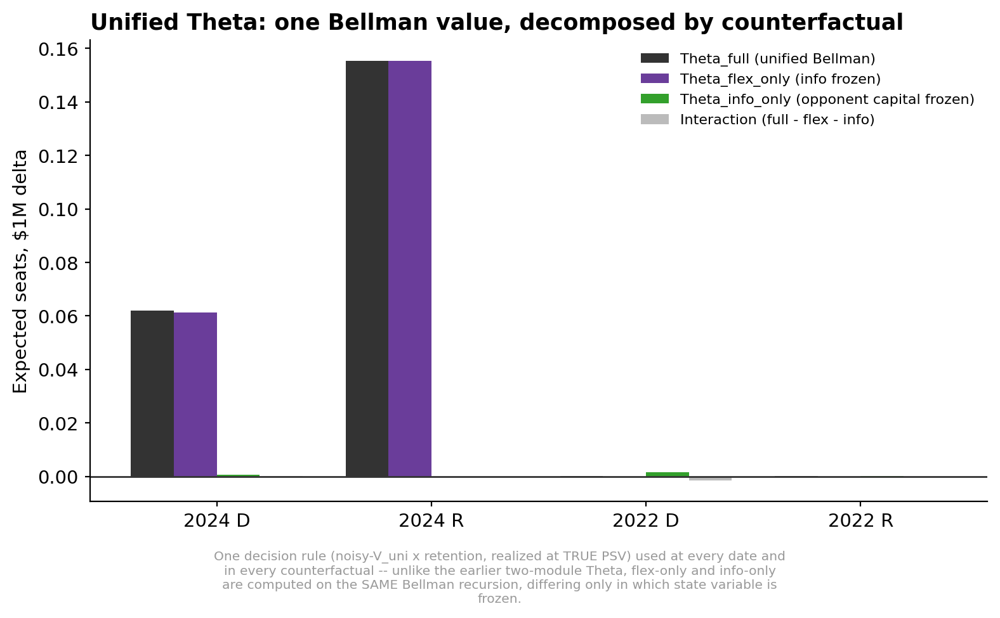
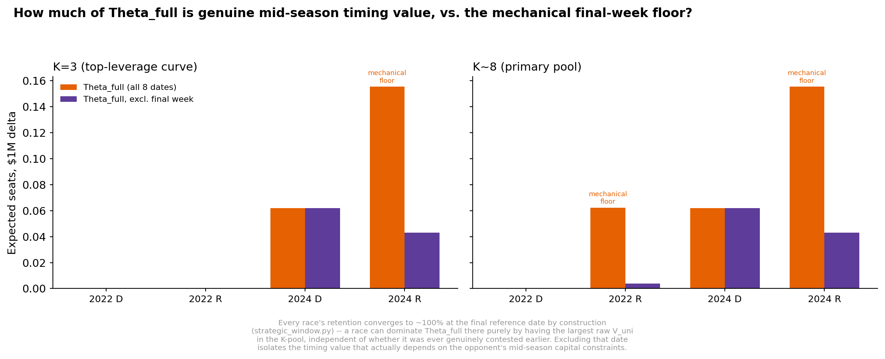
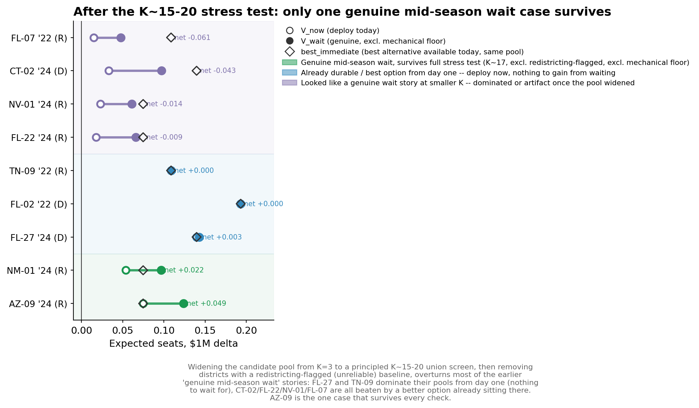
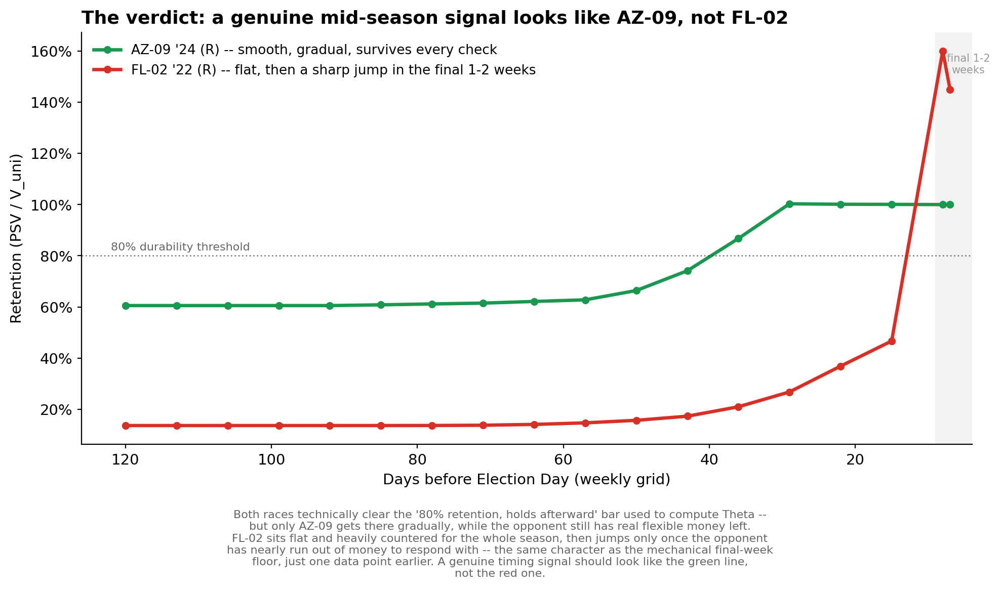

# Abstract {-}

We model national House campaign committee spending as a two-player
strategic allocation game and ask whether a party can identify spending
opportunities its opponent cannot simply optimize away. This paper
presents the answer as it was actually found: a sequential narrative of
discovery, in which each measurement either survived scrutiny or was
overturned by the next, more careful one. Early static analysis suggested
several expected seats of exploitable opportunity; correcting a flawed
shared payoff formula, and then allowing the opponent to reciprocally
optimize, erodes most of it. The resulting strategic solution is not a
deterministic equilibrium but a small-support distribution over
near-optimal portfolios, confirmed by three independent solution methods.
Observed committee spending resembles neither this equilibrium nor a
unilateral optimum, but tracks a simple competitiveness heuristic closely.
Introducing irreversible capital commitments reopens a second, dynamic
channel: a race easily countered today can become durable later, once the
opponent's flexible budget has shrunk. Building a unified sequential
decision model of this channel and stress-testing it exhaustively —
widening the candidate universe from 3 to roughly 20 races per side,
filtering data-reliability confounds, and refining the time grid from
monthly to weekly — eliminates all but one candidate timing opportunity.
We argue this pattern, in which successive rounds of scrutiny kill most
apparent findings and leave one standing, is itself evidence that
campaign spending behaves like an already-adapted strategic environment —
a convention equilibrium — rather than an exploitable inefficiency.

# Part I: A Sequential Narrative of Discovery {-}

*Figure 1 — The research arc: from apparent static opportunity to one surviving timing opportunity*

{width=100%}

The sections that follow walk through this arc in full, in the order the
findings were actually made: static exploitability (Section 2) is
competed away by reciprocal optimization into a mixed-equilibrium
distribution (Sections 3-5), most of what remains is explained by a
simple heuristic rather than either optimization-derived strategy
(Sections 6-9), irreversible capital reopens a second, dynamic channel
(Sections 10-14), and four successive stress tests (Sections 15-18)
eliminate every candidate timing opportunity but one.

# 1. Setting up the game: from raw spending totals to a shared payoff

The project's first task was mundane and turned out to matter more than
expected: deciding what "spending" a two-player model should actually let
each committee control. An initial pass treated every non-candidate
dollar in a district — state party money, unaffiliated super PAC
independent expenditures, everything — as if DCCC and NRCC could freely
reallocate it. That is not true; a two-player game handed an action space
neither player can actually move through is not modeling the strategic
decision at all. Decomposing each race's total spend into candidate
disbursements, each national committee's own coordinated and independent
expenditures, state-party coordinated spending, and outside-group
independent expenditures (verified via a checked accounting identity
against FEC bulk data) and restricting the two players' controllable
money to the first category alone cut the modeled budget from $465.2M to
$102.1M for DCCC and from $132.1M to $47.2M for NRCC in 2024 — the D/R
budget ratio moved from an implausible 3.5x to a more defensible 2.2x. A
matching audit on the Republican side turned up $153,650 (2024) and
$131,425 (2022) of previously uncounted state-party coordinated spending,
closing a coverage gap that had only ever been fixed for Democrats in
this project's predecessor work.

Even with the right action space, the shared win-probability function
both sides' best responses search against needed to be genuinely shared,
not two different formulas rescored after the fact. The first attempt to
fix this — searching R's best response directly against the literal
D-anchored formula — broke worse than the problem it was meant to solve:
R's optimizer dumped roughly $3M each into HI-02, TX-20, and NC-04, three
safe Democratic seats with essentially no Republican presence (HI-02's
recorded Republican candidate-committee spending was $10), dragging
modeled Democratic win probability in those seats from ~99% to 30-40%.
The old, cruder mirrored-ceiling formula it replaced had, despite its own
flaws, been doing real regularization work the "exact" fix silently
discarded; the change was reverted rather than shipped. The eventual fix
replaced the moving, party-specific floor with a fixed, two-sided
baseline and a symmetric `tanh` saturation term — the same functional
ceiling shape as before, but anchored so that neither side's spending
could push the model into an unregularized extrapolation. A latent
divide-by-zero bug in the gradient computation, which had been silently
producing an impossible negative regret for Democrats, was caught by a
regression test checking that best-response regret can never be negative
by construction, not by inspection. This shared, validated payoff
function — not the original design — is what every subsequent result in
this project is computed against.

# 2. First measurement: static exploitability, and an asymmetry that reversed

With the corrected budget scoping and shared payoff in place, the first
substantive question was the simplest one: holding each side's observed
spending fixed, how many expected seats could the other side gain by
reoptimizing unilaterally?

*Table 1 — One-shot unilateral exploitability*

| Cycle | RegretD | RegretR | E (total) | E as % of D-seat total |
|---|---|---|---|---|
| 2022 | 3.03 | 2.41 | 5.44 | 2.53% |
| 2024 | 2.84 | 2.30 | 5.14 | 2.37% |

*Figure 2 — Static exploitability (panel A), and the equilibrium support decomposed in Section 5 (panel B), shown together for scale*

{width=100%}

This result is small — roughly 2.4-2.5% of the D-seat total in both
cycles — but it also reversed a finding from earlier, cruder versions of
this project: under the old mirrored-ceiling payoff, Republicans appeared
to have systematically more to gain than Democrats (RegretR > RegretD in
both cycles). Under the corrected, symmetric payoff, that asymmetry
disappears and even flips: RegretD is now the larger term in both cycles.
RegretD barely moved between the two payoff versions (D's side was never
the one exploiting an unregularized extrapolation); RegretR fell by
roughly a third. The original asymmetric narrative was itself, in
retrospect, an artifact of the looser payoff formula, not a real
finding about the two parties.

A second, narrower data artifact was caught while ranking candidate races
by this exploitability measure for later use: several flagged races
turned out to have exactly $0 in current party spending, and the marginal
seat gain evaluated at exactly $0 sits at the steepest, most unstable
point of the persuasion-response curve. One flagged case (GA-07, 2024)
showed a unilateral value of +0.0395 expected seats that barely changed
(+0.0394) when the deviation size was increased tenfold, while the
opponent-adjusted persistent value at the same race got WORSE across the
same test (142.5% retention rising to a nonsensical 195.7%) — a clean
signature of a candidate-selection artifact, not a real strategic
opportunity. The fix, applied throughout the rest of this project,
restricts any candidate-race ranking to races with real current party
spending (over $10,000) before selecting by exploitability, and treats
any deviation whose unmodified unilateral value is below 0.001 expected
seats as immaterial rather than reporting a percentage retention
computed on noise.

# 3. Searching for equilibrium: a limit cycle, not a fixed point

Static exploitability describes a one-shot deviation; it says nothing
about what happens once both sides are allowed to reoptimize repeatedly
against each other. The natural next step — damped best-response
dynamics, each side alternately best-responding to the other's most
recent allocation — was expected, based on earlier, cruder versions of
this project, to converge cleanly to a mutual best response within about
a dozen rounds.

It did not. Under the corrected payoff, two independent damping regimes
(a faster one at 150 rounds, a more conservative one at 300) both settled
into a small, bounded, non-shrinking oscillation instead of a fixed
point: residual regret in the 0.06-0.15 expected-seat range on the
Democratic side and 0.51-0.68 on the Republican side, never reaching
zero, unmoved by more rounds or gentler damping. A concave-envelope
surrogate — validated against exact nonlinear optimization to within
0.03-0.10 expected seats at 500-1,000x the computational speed — made it
possible to push this search far further than exact optimization could
feasibly manage: three starting points, 2,000 rounds each. The result
replicated and sharpened: the 2022 orbit settled at 216.44-216.48 expected
D seats (versus 215.17 observed), the 2024 orbit at 218.57-218.59 (versus
217.17 observed), with a warm-started exact regret check confirming both
orbits sit close to, but never at, a zero-regret fixed point (2024: +0.19
D / +0.25 R; 2022: +0.32 D / +0.44 R). Allocation-space distance from the
observed spending pattern to this orbit remained large throughout ($355.0M
in 2022, $292.9M in 2024) even as the seat-count gap stayed small — the
first sign that "close in expected seats" and "close in dollars" are not
the same claim, a distinction that matters for every benchmark comparison
later in this paper.

# 4. Is there a pure equilibrium nearby after all? Three independent checks

A cycling dynamic is not, on its own, proof that no low-regret
deterministic fixed point exists nearby — only that these particular
dynamics do not find one. Three independently designed methods were used
to check.

*Table 2 — Three independent searches for the lowest reachable combined regret*

| Method | 2024 combined regret (E) | 2022 combined regret (E) |
|---|---|---|
| Observed allocation | 5.14 | 5.44 |
| Best-response orbit (Section 3) | ~0.44 | ~0.76 |
| Direct search: trajectory scan + basin-hop + exact refine | 0.484 | 0.862 |
| Fictitious play (time-average strategy, exact-checked) | **0.359** | 0.666 |
| Double-oracle mixed equilibrium (exact LP) | **converged**, value 218.60 | **converged**, value 216.375 |

The direct search — a 400-round, 3-start trajectory scan combined with
local stochastic search and an exact refinement step — landed back in
the same 0.48-0.86 combined-regret band the orbit itself found, evidence
against a low-regret deterministic point existing nearby rather than a
search-thoroughness gap. Fictitious play (each side best-responding to
the other's running time-average allocation, not its most recent play) is
the sharper diagnostic: for 2024, the exact-checked value of the
time-averaged strategy pair (0.359) beats BOTH the best pure point the
direct search found (0.484) and the raw orbit's own residual (~0.44) —
the specific signature predicted if the true equilibrium is genuinely
mixed rather than pure, since only a randomized strategy can outperform
every pure strategy searched. A finite mixed-strategy solve (double
oracle: build a growing pool of full-portfolio "strategies" for each
side, solve the resulting finite zero-sum matrix game exactly via linear
programming, and add each side's best response to the pool if it
improves by more than a small tolerance) converges on both cycles — 13
rounds for 2024 with 5-portfolio support per side, 52 rounds for 2022 (25
initial plus a 27-round resumption) with 11-portfolio support per side.
The remaining asymmetry between the two cycles is in difficulty, not
existence: 2022 needed roughly four times the rounds and twice the
support size of 2024.

# 5. Decomposing the mixed equilibrium's support

A mixed equilibrium over 5-11 full 433-race portfolios per side is
correct but not directly interpretable — "a probability distribution over
433-dimensional vectors" says nothing a decision-maker can act on.
Decomposing it race by race (each race's mean funding level and its
coefficient of variation across the support portfolios) sorts the
433-race universe into three groups: **irrelevant** (essentially never
funded across the support), **core** (funded at nearly the same level by
every support portfolio), and **swing** (funded only by some support
portfolios — where the mixture's randomization actually lands).

*Table 3 — Equilibrium support composition*

| Cycle | Side | Core | Swing | Irrelevant | Cap per race |
|---|---|---|---|---|---|
| 2024 | D | 30 | 29 | 374 | $15.3M |
| 2024 | R | 26 | 26 | 381 | $7.1M |
| 2022 | D | 38 | 37 | 358 | $14.9M |
| 2022 | R | 36 | 35 | 362 | $13.7M |

2022's larger equilibrium support is a difference in which races matter,
not just how many portfolios it takes to describe it: 2022 touches 75
distinct D-side races (38 core + 37 swing) against 59 in 2024, and 71
R-side races against 52 — consistent with 2022 having a genuinely
broader, more contested strategic landscape rather than 2022's search
simply needing more rounds to finish. A committee reading this
decomposition would not see "here is your one target list," but "these
~30 races are core to every version of the strategy; these ~29 are where
staying unpredictable actually matters; everything else is outside the
equilibrium's support entirely."

# 6. Does observed behavior look like this equilibrium? Benchmarking against five strategies

None of the preceding sections say anything about what DCCC and NRCC
actually did. A five-way benchmark compares the observed 2022 and 2024
allocations against equal allocation, a Cook-rating competitiveness
heuristic (spending proportional to a fixed weight by competitiveness
category, capped and redistributed), the one-sided optimizer, the mixed
equilibrium, and the mean of twenty random feasible portfolios — both by
L1 distance from what was actually spent and by modeled expected D seats.

*Figure 3 — Observed spending vs. five candidate strategies*

{width=100%}

Observed spending is closest, by a wide margin on both cycles, to the
Cook-rating heuristic ($192.1M L1 distance in 2024, $203.5M in 2022) and
roughly tied for farthest from both optimization-derived benchmarks
(one-sided optimizer: $292.6M/$344.7M; mixed equilibrium: $293.1M/$349.2M).
Equal allocation and random feasible portfolios both land closer to
observed than either optimization-derived strategy does, on both cycles.
The seats story sharpens the point: the Cook heuristic (218.14 expected D
seats in 2024, 215.82 in 2022) sits close to what was actually achieved
(217.17, 215.17), while the strategies that are farthest from observed IN
ALLOCATION SPACE score only marginally better (one-sided: 218.50/216.40;
mixed equilibrium: 218.60/216.38) — the strategies farthest from what
committees actually do also perform best, exactly the pattern expected if
committees are running something closer to a competitiveness-proportional
rule of thumb than either a unilateral optimum or a solved equilibrium.

# 7. Stress-testing the payoff model itself

Before trusting any of the preceding sections' numbers as more than an
artifact of one estimated response curve, two checks were run directly
against the payoff model's own assumptions.

**Does the same persuasion-response elasticity really apply to both
parties?** The shared payoff's single spending-elasticity coefficient had
only ever been estimated on a sample where Democrats were the repeat
challenger attacking an R-held seat — the mirror-image sample (Republicans
as repeat challenger) had never been tested. Estimated on that mirror
sample directly, the two coefficients differed sharply and significantly
(D-challenger: beta=5.47, 95% CI [2.36, 8.59], n=118; R-challenger:
beta=24.17, 95% CI [9.28, 39.06], n=143; a pooled interaction test rejects
equal slopes at p=0.016). But the two samples sit at nearly disjoint
points on the underlying spending-share axis (mean D-share 0.22 versus
0.90) — comparing the local slope of a nonlinear response curve at two
very different points, not a clean party-versus-party difference. Trimming
both samples to a shared, overlapping spending-share band narrows the
estimates substantially (10.04 versus 19.07) and the test can no longer
reject equal slopes (p=0.188). A further check replaced the single
linear-in-log-ratio elasticity with a genuinely flexible cubic response
curve fit to the full untrimmed sample: it also cannot reject symmetry
(p=0.799), and a nested F-test confirms the cubic curvature is itself
statistically justified over a quadratic version of the same approach
(p=0.013) — the data prefers the specification under which symmetry
holds, not the other way around. Net verdict, three independent checks
agreeing: the shared payoff's single elasticity coefficient is a
reasonable approximation, not an unexamined shortcut.

**Does an inflated candidate-spending figure for a few well-known
politicians distort anything?** FEC's bulk "total disbursements" field
includes categories beyond a candidate's own campaign spending — most
notably, for high-profile party leaders, redistribution to other
candidates' campaigns through their personal fundraising operations.
Checked directly against FEC's own per-candidate totals API: 62% of
Nancy Pelosi's reported 2022 disbursements ($28.28M of $28.28M TTL_DISB)
was this "other disbursements" category rather than her own district's
campaign spending; 28% of Hakeem Jeffries' 2024 figure. Real, but
provably inert: the model's actual decision variable is party money net
of the candidate floor, which cancels this inflation out algebraically,
and the one channel that does depend on the floor's magnitude only
matters for races that are already numerically saturated regardless
(every affected leadership district sits in a Safe seat with modeled
marginal seat gain between 1e-8 and 1e-17).

# 8. From aggregate exploitability to persistent value: which specific opportunities survive?

Aggregate exploitability answers "how much, in total"; it does not say
which specific races drive it, or whether a given race's apparent
opportunity survives the opponent's actual best response rather than
merely a one-shot deviation held against a passive baseline. For any
specific race, `V_uni` (the one-shot unilateral value of a deviation,
opponent held fixed) and `PSV` (persistent strategic value, opponent
allowed to fully reoptimize) can differ sharply — their ratio, retention,
separates races the opponent has no efficient way to counter (retention
near or above 100%) from races that are answered almost completely
(retention as low as 10%). Sorting the full 433-race universe by a
race-level surplus statistic and re-deriving a quadrant taxonomy under the
corrected payoff shows a materially different picture from earlier,
cruder versions of this project:

*Table 4 — Race taxonomy under the corrected payoff*

| Quadrant | 2022 | 2024 |
|---|---|---|
| Possible over-capitalization | 197 | 186 |
| Democratic opportunity | 103 | 125 |
| Under-contested / escalation pressure | 73 | 52 |
| Republican opportunity | 60 | 70 |
| Locally equilibrated | 0 | 0 |

"Republican opportunity" was the smallest bucket under the earlier,
cruder payoff (15 races in both cycles); under the corrected, properly
regularized ceiling it roughly quadrupled in 2022 (to 60) and became the
second-largest bucket in 2024 (70) — though a direct check of the
specific races NRCC currently funds shows every one of its top-ranked
current targets still falls below the materiality threshold for genuine
opportunity, meaning the Republican opportunity that does exist is not
concentrated in the races Republicans are currently prioritizing.

# 9. Can an opponent be forced to sacrifice, not just respond?

A natural follow-up question is whether a deviation can be engineered not
merely to be hard to counter, but to force the opponent to sacrifice one
of its OWN valuable races to respond — a "decoy" mechanism. Because this
project's payoff is constant-sum, the algebra collapses cleanly: "how much
does moving money into race i cost the opponent, measured by the
opportunity value it sacrifices responding" is, after substitution,
exactly persistent strategic value read off the other side of the same
ledger — not a new statistic, but the same one from a different
perspective. What IS new is the response-displacement map: which specific
races the opponent's best response pulls money OUT of to finance its
answer.

The result, replicated across both cycles, cuts against the decoy
hypothesis at the dollar scales tested ($250K-$12M): both sides finance
almost any small-to-moderate response from an identical, small, stable
reserve of their own lowest-priority currently-funded races, largely
independent of which race the pressure targets. Four different 2022
Democratic-side pressure points (CT-02, NC-06, NY-20, AZ-02) all draw from
the identical eight-race Republican reserve; four different Republican
pressure points draw from an identical eight-race Democratic reserve.
Pushed further, to $3M-$12M — deliberately past what any single real race
would plausibly absorb — leverage mostly declines smoothly with
commitment size (diminishing returns dominate), a few races stay
essentially cost-free to press even at $12M, and one sharp exception
(NC-06, R-side 2024, leverage jumping from 0.013 to 0.061 seats-per-$M
between $3M and $5M) was checked directly via a warm-started re-solve
before being trusted, confirming it as a real threshold effect in a
specific, later-flagged lower-confidence district rather than a solver
artifact. The practical reading: committees have real slack, and it
absorbs pressure without ever touching their priority targets — "commit
more to force a bigger sacrifice" is not, in this data, a reliable
strategy.

# 10. Introducing time: irreversible capital and response delay

Every result through Section 9 gives the opponent a "godlike" response,
re-solved from scratch as though every dollar spent so far could be
costlessly reallocated. Real committees cannot do this: money already
spent is locked in. Formalizing each side's budget at date *t* as
`B_t = L_t + F_t` (capital already locked plus what remains flexible,
`F_t` shrinking toward zero as Election Day approaches, calibrated
against real dated FEC transaction data) and constraining the opponent's
best response to `F_t` rather than the full budget makes it possible to
ask directly whether locked-in capital changes the retention picture.

Choosing September 1 as a reference date (checked against the data first,
not assumed: by that date only 1-6% of either committee's eventual
national spending has occurred in every cycle/party combination) and
comparing retention with the opponent's response fully flexible against
retention with the opponent constrained to its actual committed capital
by a later date, the predicted effect — retention rising as the
opponent's flexible budget shrinks — held clearly for five of twelve
tested races, all of them races that were only partially answered under
full flexibility: NV-01 2024 (41% to 71% retention), FL-22 2024 (34% to
60%), CT-02 2024 (63% to 75%), AZ-02 2022 (65% to 86%), and more weakly
NC-06 2024 (10% to 18%). Races already near full retention stayed flat, a
ceiling effect with nothing further to gain. A counter-example was
reported rather than smoothed over: three races with retention already
ABOVE 100% under full flexibility (MD-03 2022, NY-20 2022, CT-05 2024) —
already-documented cases where the opponent's full-portfolio
reoptimization happens to land somewhere more favorable to the mover than
a naive baseline predicts — show retention FALLING, not rising, as the
opponent's capital locks in. The mechanism is coherent: locking capital
removes the specific second-order reshuffling flexibility that produced
the above-100% bonus in the first place. Response delay helps a mover
when the opponent was genuinely going to partially neutralize the move;
it does not help, and can mildly hurt, when the apparent opportunity was
itself an artifact of the opponent's own unconstrained flexibility.

# 11. When does an opportunity become durable? The strategic window

Response delay tested one fixed reference date. The more direct
descriptive question is how retention evolves continuously as the
election approaches — and whether the timing curve is genuinely uniform
across races of different competitiveness, which turned out not to be
true: partial pooling by Cook-rating tier (competitive / lean /
safe-likely) revealed a real gradient in three of four cycle-party
combinations tested (2022 Republican: competitive races' national-
committee spending has a median transaction date of October 11, against
October 18 for lean races and October 25 for safe/likely races, a real
two-week spread), so a single blended commitment curve was hiding
structure that mattered.

Sweeping retention across eight reference dates (120 down to 7 days
before Election Day) for the same twelve candidate races, using each
race's own tier-appropriate commitment curve, confirmed a mechanical
floor common to every race by construction: every one of the twelve
curves lands at 99.8-100.0% retention at 7 days out, regardless of where
it started — both committees are nearly out of flexible money for
EVERYONE at that point, a floor, not a race-specific finding, and treated
as uninformative accordingly. The genuinely new result sits in the
races that started below full retention: three of four (CT-02, FL-22,
NV-01 in 2024; AZ-02 in 2022) cross an 80%-retention threshold and STAY
above it roughly 30 days before Election Day, while the opponent still
has $25-60M in flexible budget remaining — a real, actionable lead time,
not merely "wait until the opponent runs out of money." The fourth
(NC-06) does not cross 80% until the final week, consistent with that
district's separately documented baseline instability.

*Figure 4 — Retention trajectories for the twelve candidate races, both cycles*

{width=100%}

The trajectories make the mechanism, and its limits, visible directly:
most curves are flat or gently rising, three cross the 80% threshold with
real lead time, and the counter-examples from Section 10 (MD-03 2022,
NY-20 2022) sit well above 100% throughout and drift down rather than up
— a reminder that "capital locking in raises retention" is a tendency
observed in most races, not a law that holds in every one.

# 12. Is durability actually worth waiting for?

Durability rising with delay answers a different question than whether
waiting was the right call: the second question requires comparing the
delayed value against what the same capital could have achieved deployed
immediately elsewhere, not just against that same race's own earlier
value. Defining net waiting value as the race's value at its own
first-crossing durability date minus the best value achievable today
across a small pool of pre-screened alternative candidates, only five of
the twelve races involved a genuine wait at all (the other seven were
already durable on day one, so there was nothing to decide).

The result was sharply conditional rather than universally positive: net
waiting value was large and clearly positive only for the 2024 Republican
pool — NC-06 (+0.155 expected seats), FL-22 (+0.043), NV-01 (+0.038) —
specifically because every candidate in that pool was mediocre
immediately available (the best immediate alternative topped out at
0.023 expected seats), so nothing was foregone by waiting for any one of
them. One Democratic 2024 race (CT-02) showed a modest genuine gain
(+0.008). Everywhere else, waiting was roughly neutral to negative:
WI-03 2022 (-0.025), AZ-02 2022 (-0.015), PA-12 2022 (-0.012), FL-27 2022
(-0.006), CT-05 2024 (-0.004) all showed a better immediate alternative
beating whatever the race's own delayed value eventually reached. AZ-02
is the cleanest illustration of why these are different questions: its
own retention rose substantially with delay (63% to 86%), but NY-20 was
simply a better immediate choice throughout the entire season (0.055
versus AZ-02's fully matured 0.040) — "this race becomes more durable if
you wait" and "you should wait for this race" are genuinely different
claims, and conflating them was exactly the mistake this comparison was
built to catch.

# 13. A second timing channel: does the committee's own uncertainty matter?

Everything through Section 12 holds the committee's information fixed —
the true generic-ballot environment is assumed known with certainty.
A second, conceptually distinct channel is whether a committee's own
uncertainty about which race is currently best, resolving over time as
the election approaches, has independent option value. Simulating a
shared national-level shock to every race's modeled margin (calibrated
against pooled 2018-2024 historical generic-ballot volatility, checked
directly against each cycle's own realized series rather than assumed
constant) and asking how often noisy information leads a committee to
pick a different "best" race than the truth would have picked required no
new best-response solves at all — the shock enters the margin model
additively, so the unilateral value of any candidate race under a given
noise draw is closed-form.

A sanity check on the very first run surfaced a real, separate finding
before the intended one: the naive zero-noise benchmark ("does the model
recover the true best race when there is no noise") failed, because the
race with the highest raw unilateral value was not the race with the
highest persistent (opponent-adjusted) value — 2024 D-side, CT-02 has the
higher V_uni (0.053) but WI-01 has the higher PSV (0.036), because CT-02's
opponent response erodes far more of its raw appeal (62% retention)
than WI-01's does (99%). Anchoring the noise-free comparison point to the
V_uni-based pick (the plausible real-time heuristic, rather than the
game-theoretically correct PSV-based pick) isolated the information
question from this ranking disagreement — but the disagreement itself
replicated in all four of four cycle-side combinations tested: a
committee optimizing on raw persuadability alone would pick the WRONG
race, strategically, in every single test run. Measured against V_uni's
own ranking rule, the resolved-information channel itself is tiny: at or
indistinguishable from zero in three of four pools (the same race gets
picked in 4,998-5,000 of 5,000 simulated draws), and real but small in the
fourth (2022 Republican, where three closely-matched candidates split the
noisy pick and the resulting information value is +0.0013 expected
seats). The V_uni/PSV disagreement — not the tiny information-value
number itself — is the more consequential finding: it means a decision
rule based on the cheap, closed-form signal (V_uni) and a decision rule
based on the game-theoretically correct one (PSV) will not just differ in
degree, but can disagree about which race is even the right target.

# 14. Unifying both channels into one Bellman value

Sections 12 and 13 measured strategic flexibility and information
resolution as two separately built diagnostics — and Section 13's own
finding (V_uni and PSV disagree about which race is best) meant the two
diagnostics were implicitly using two different decision rules: Section
12 ranked candidates by PSV, Section 13 by V_uni. Adding them together as
"Theta = information value + strategic flexibility value" was not yet a
decomposition of one common objective.

The fix uses one decision rule everywhere: a committee's ESTIMATE of a
race's persistent value under a noisy signal is `V_uni_noisy(epsilon) x
retention(t)` — V_uni's cheap noise-simulation machinery from Section 13,
combined with the TRUE, zero-noise retention ratio from Section 11 — with
the committee picking the highest-estimated race and realizing that
race's TRUE persistent value. A single Bellman recursion,
`V_t(X_t) = max(V_deploy(X_t), V_{t+1}(X_{t+1}))`, backward-induces the
value of waiting across the same reference-date grid Section 11 already
swept, under three regimes that hold one state variable fixed at a time —
full, information-frozen, and opponent-capital-frozen — rather than
adding two differently-defined numbers together.

*Figure 5 — The unified decomposition, initial 3-candidate pool*

{width=100%}

At this initial, hand-picked scale, the value of waiting is driven almost
entirely by strategic flexibility, not by the committee's own uncertainty
resolving — the information channel sits at or near zero in three of four
pools, and the two-module conclusion survived being placed on one common
footing. One genuine correction fell out of the unification itself:
CT-02's true value of waiting (+0.062) is roughly eight times Section
12's own estimate (+0.008), because Section 12 measured value at the
FIRST date retention crossed 80%, while CT-02's persistent value actually
peaks later (183% retention at 21 days out, a documented second-order
equilibrium effect) before settling back down — a blind spot the full
backward-induction recursion does not have, since it takes the maximum
over the entire remaining horizon rather than stopping at the first date
clearing a threshold.

# 15. Stress test 1: widening the action space

A three-candidate, hand-picked pool per side cannot rule out that a
better opportunity sits just outside it. Widening to the full pool
`strategic_leverage.py`'s own screen had already solved once (the
top-4-swing plus top-4-by-surplus candidates, 7-8 districts per side) and
re-running the full exact-optimization date sweep (roughly 140 additional
best-response solves per cycle) left three of four pools completely
unchanged to four decimal places — the narrower screen already contained
the portfolio-optimal choice in most cases. The exception, 2022
Republican-side, gained two new candidates (FL-07, PA-04) with roughly
2.5-3 times the raw unilateral value of anything in the original pool,
raising that pool's headline value of waiting from +0.0002 to +0.0622.

# 16. A mechanical artifact found: the final-week floor

Section 11 already established, and flagged as uninformative, that every
race's retention converges toward 100% at the very end of the cycle by
construction. The Bellman recursion built in Section 14 had no equivalent
safeguard: its maximization runs over every reference date INCLUDING that
mechanical one, so a pool member with a large raw unilateral value will
always look "worth waiting for" at the final date regardless of its
actual trajectory — a risk that grows with the size of the candidate
pool, since a wider pool is simply more likely to contain some
large-value race.

*Figure 6 — Genuine vs. mechanical value of waiting*

{width=100%}

Re-running the same recursion with the final reference date excluded cuts
the largest finding from Section 15 sharply: 2024 Republican-side value
of waiting falls from +0.155 to +0.043 (roughly a quarter of the headline
number, still genuinely positive, realized 30 days out rather than at the
mechanical floor). The 2022 Republican "discovery" from Section 15 is
almost entirely explained away: +0.0622 collapses to +0.0037 once the
mechanical floor is excluded — FL-07 was never a genuine mid-season
timing opportunity, at either pool size tested.

# 17. Stress test 2: a principled K~15-20 screen, and a second confound

A hand-selected 7-8-candidate pool is still not a systematic search.
A four-criterion union pre-screen — the top current-leverage races, the
top raw-persuadability races, the equilibrium's own swing races (Section
5), and a "revealed contested-ness" proxy standing in for the true, too-
expensive-to-compute strategic-window slope — landed at 16-21 candidates
per side without manual tuning, run on both cycles for roughly 616
additional best-response solves. FL-07 reappeared in the union pool
independently, via the raw-persuadability criterion this time rather than
the swing-race criterion that first surfaced it — cross-validation that
its large raw appeal is a real, reproducible feature of the data, even
though Section 16 had already shown it is not a genuine timing
opportunity.

The wider pool's headline numbers moved again — 2024 Democratic value of
waiting rose to +0.0796, 2024 Republican fell to +0.1033 — and tracing
what drove the new 2024 numbers surfaced a second, previously unseen
confound: the largest new candidates pulling both 2024 pools upward
(NC-06, NC-13, NC-14 on the Democratic side; NC-01, NC-06, NC-13, NC-14 on
the Republican side) were concentrated in districts this project had
already flagged elsewhere as having unstable, redistricting-affected win-
probability baselines (a separately verified sharp discontinuity in
NC-06's own response surface had already been traced to exactly this).
Excluding redistricting-flagged districts from the candidate pool before
re-running the recursion changes the picture substantially:

*Figure 7 — The stress test's verdict, race by race*

{width=100%}

2024 Democratic value of waiting collapses from +0.0796 to +0.0032 — and
CT-02, the earlier headline example, turns out not to be why. The wider,
cleaned pool surfaced FL-27, a race never included in any earlier pool,
already at 112% retention on day one with more than double CT-02's raw
value — once FL-27 is available, waiting specifically for CT-02 is
strictly dominated. 2024 Republican-side's surviving candidate is AZ-09,
not NC-06: smoothly rising from 60.5% retention at 120 days out to full
durability by 30 days out, beating its own best immediate alternative
(NM-01) by a clear margin. Of five candidate "genuine mid-season wait"
stories carried into this stage across this project's history (CT-02,
FL-22, NV-01, NC-06, FL-07), four are now dominated by a better
immediately-available alternative or explained by the redistricting
confound; only AZ-09 survives.

# 18. Stress test 3: weekly time resolution — the final verdict

The last open question is whether an 8-date reference grid could be
concealing sharp, non-monotonic behavior between observations — exactly
the pattern already documented for the redistricting-flagged districts.
Re-running the surviving, cleaned candidate pool on an 18-point weekly
grid (120 down to 7 days out in 7-day steps, roughly 1,240 further
best-response solves) tests this directly, on the same pool Section 17
validated, deliberately kept separate from the K-widening step per this
project's own practice of stress-testing one dimension at a time.

*Figure 8 — The weekly-resolution verdict*

{width=100%}

AZ-09's value at weekly resolution (+0.0492) is unchanged to three
decimal places from the 8-date estimate, and its underlying trajectory
remains completely smooth — the confirmation Section 17 could only
predict, not yet demonstrate. The finer grid did surface one new
candidate value (2022 Republican side) that a single-date exclusion rule
does not flag, realized one week before the excluded mechanical date
rather than exactly on it — but its underlying trajectory is flat for ten
consecutive weekly readings and then jumps sharply in the final two
weeks, the same character as the mechanical floor itself, caught only by
direct visual inspection of the trajectory's shape rather than by any
automated rule this project currently has. Rejected for the same reason
Section 16 rejected the literal final-week effect.

# Part II: Synthesis and Interpretation {-}

# 19. The surviving result is an existence proof, not a typical payoff

AZ-09 should not be read as the substantive discovery of this project,
and reporting "+0.049 expected seats" as a headline number would misstate
what the eighteen preceding sections actually found. The search that
produced it ranged across two election cycles, both parties, three
successively wider candidate pools, eight and then eighteen reference
dates, and four independent screening criteria. Reporting the single best
surviving value from a search that wide is subject to an unavoidable
selection effect — `max_i,t V_i,t` will tend to overstate the true,
typical payoff to strategic waiting even if every individual estimate is
reasonably unbiased on its own, the same logic behind a winner's-curse
correction in any auction or specification search.

The scientifically stronger statement is therefore not "waiting 30 days
in AZ-09 was worth 0.049 seats." It is:

> After progressively widening the action space and eliminating terminal,
> reliability, and dominance artifacts, one smooth mid-season timing
> opportunity remained. The overwhelming majority did not.

AZ-09 functions as an existence proof and a mechanism illustration — a
concrete demonstration that the theorized channel (opponent capital
locking in → some previously-counterable moves become durable →
durability occasionally exceeds the best immediate alternative) can and
does occur — not as an estimate of how often it occurs or how large it
typically is.

# 20. The 2022 null result is part of the finding

Both sides in the 2022 cycle show essentially zero genuine mid-season
timing value after the same corrections, despite that cycle exhibiting
substantial static strategic structure by every earlier measure in this
paper: comparable exploitability to 2024 (Section 2), and in fact a
LARGER, more contested mixed-equilibrium support (Section 5) — an
eleven-portfolio support touching 75 D-side and 71 R-side races, against
2024's five-portfolio support touching 59 and 52. Static opportunity and
dynamic timing opportunity are not the same thing, and this project finds
real evidence for the former without finding the latter, in the same
cycle.

This null is not a failed experiment; it is the source of this paper's
central empirical claim. Strategic timing value is conditional, not a
universal property of the game: `Theta_genuine approx. 0` for both sides
in 2022, against a single, limited, existence-proof-level positive
result for one side in 2024. A finding that held in both cycles under
every correction applied across Sections 15-18 would have been
implausible on its face, given how much money and repeated-play
experience both committees bring to this decision every cycle. A rare,
conditional, cycle-dependent result is the pattern a genuinely adapted
strategic environment should produce.

# 21. Answering the original question

The project began by asking whether a party could identify spending
strategies its opponent could not simply reciprocally optimize away.
Nineteen sections of narrowing, correcting, and stress-testing give an
answer with two distinct parts.

**Not generally through static allocation** (Sections 2-9). The opponent
usually retains enough portfolio slack to respond; larger "forcing"
commitments run into diminishing returns rather than exhausting that
slack; and static reciprocal optimization converges toward a distribution
over near-equivalent portfolios rather than one unbeatable deterministic
allocation.

**But irreversible spending creates a second channel** (Sections 10-18).
As the opponent commits capital, its feasible response set shrinks, and
some previously counterable moves become durable. Durability improving
over time is a NECESSARY condition for waiting to be attractive — Section
12 already showed it is not a SUFFICIENT one. The comparison that
actually determines whether waiting is the right call is

```
V_wait(i)  >  max_j  V_deploy_now(j),
```

not durability in isolation. AZ-09 clears that bar; every other candidate
tested across this project does not, once measured correctly. That
comparison — not "does retention improve with time" — is the real result
of this project's dynamic extension.

# 22. Conclusion

> Campaign spending is a strategic allocation problem in which apparent
> opportunities against a passive opponent are substantially reduced once
> reciprocal optimization is allowed. Irreversible capital commitments can
> reopen some of those opportunities over time by constraining the
> opponent's feasible response, but this does not create a general
> advantage to waiting. Across the 2022 and 2024 House cycles, most
> apparent timing opportunities were eliminated after accounting for
> better immediate alternatives, mechanical end-of-cycle constraints,
> unstable race baselines, and finer temporal resolution. One 2024 case
> survived all of these tests, demonstrating that genuine strategic
> timing opportunities can exist, but appear to be rare. The resulting
> decision rule is conditional: preserve flexible capital when the
> expected improvement in the future strategic opportunity set exceeds
> the best deployment available today; otherwise deploy.

These are retrospective, model-implied results from public spending and
electoral data, not causal estimates of the effect of actual committee
spending, and not evidence that a committee could have identified the
surviving opportunity prospectively, in real time, without the benefit of
hindsight and the extensive multi-stage search this project ran to find
it.

# 23. Interpretation: a convention equilibrium, not an exploitable anomaly

The pattern across Sections 2-20 — apparent opportunities that shrink
under reciprocal optimization, an equilibrium that is a distribution
rather than a formula, observed behavior that tracks a simple heuristic
more closely than any optimized strategy, and a timing channel that is
real but rare and small — is not what an unexploited market inefficiency
looks like. It is closer to what an already-adapted strategic environment
looks like.

**The useful analogy is a convention equilibrium, not raw market
efficiency.** A 2% inflation target is not a law of nature; it is an
institutional convention that anchors expectations, and it works partly
BECAUSE it is widely adopted, not because 2% is objectively optimal in
some universal sense. The Black-Scholes options-pricing formula is not
merely elegant; its influence comes from having become the common
language market participants use to think about volatility, hedging, and
relative value — though its no-arbitrage logic does have value
independent of adoption, and deviations from a widely-used pricing
framework themselves become the trades that push prices back toward it.
Campaign spending appears to have the same reflexive quality: if both
committees broadly believe serious spending belongs late in the cycle,
both structure their fundraising, polling, and race-triage decisions
around that expectation — and once both organizations behave that way,
spending earlier becomes LESS attractive precisely because the opponent
still has maximal flexibility to answer it. The convention helps create
the strategic environment that makes the convention rational.

**The House battlefield can be read as a capital market.** The "assets"
are races; their effective prices are set by competitiveness,
persuadability, both sides' current and outside spending, remaining
flexibility, and time to Election Day. DCCC and NRCC are two large
strategic investors trading in the same market. When a race's marginal
seat gain is visibly high, capital flows toward it (Section 8); that
spending drives the marginal value down, other races become relatively
more attractive, and the opponent reacts (Sections 3-4) — converging,
loosely, toward an equalized-marginal-value condition across the funded
portfolio, the same logic a capital market's no-arbitrage condition would
imply. Section 6's finding that observed allocations resemble a Cook-
rating heuristic far more than a solved equilibrium is consistent with
this market having a working institutional heuristic rather than an
analytically optimized rule: committees do not need to solve the
underlying Bellman equation to approximate its implications, any more
than most market participants need to derive an options-pricing formula
from first principles to trade options sensibly.

**This distinction — mathematical efficiency versus institutional
efficiency — matters for how the Section 18-19 timing result should be
read.** A giant, systematic, publicly-observable timing anomaly would be
strange in a political environment populated by organizations that
repeatedly spend hundreds of millions of dollars against each other and
learn from each cycle. If DCCC alone discovered that day 30 was
systematically optimal, it might extract a real advantage — but if both
sides learn it, D waits because R waits, and R waits because D waits, and
the advantage competes itself away exactly as static exploitability
already showed happens to purely allocational opportunities. A rare,
small, conditional set of surviving opportunities is precisely what this
reflexive, adapted environment should produce. In financial language:
this project is not discovering that the campaign finance market is
inefficient. It is discovering, approximately, how the market clears —
and the late-cycle spending convention itself looks like an evolved
institutional answer to the tradeoff between preserving optionality
(waiting sacrifices usability of the money) and preserving information
quality and eroding the opponent's flexibility (early deployment
sacrifices both).

# 24. Implications for a prospective application

This reframing changes what a forward-looking application of this
framework should claim to do. The goal is not "here is a superior
spending formula the committees are missing." It is closer to:
reconstruct the implicit rules by which political organizations already
convert money, information, timing, and opponent commitments into
electoral value, and use those rules to read where a future cycle
currently sits.

Concretely, for a future cycle this framework supports monitoring
questions rather than optimization prescriptions: are commitments
occurring earlier or later than the historical norm (Section 11's tiered
commitment curves); is one side preserving unusually large flexibility
relative to prior cycles; which races are being revealed as priorities by
early spending (Section 9's revealed-contested-ness signal); where is
marginal capital currently cheap or expensive relative to the fitted
response surface (Section 8's retention concept); is the opponent's
response pattern consistent with prior cycles (Sections 3-4's equilibrium
characterization); and — the direct extension of this paper's central
result — is any specific race entering a genuine, smooth strategic window
of the kind AZ-09 illustrated, as opposed to a shallow or late-arriving
one that Sections 16-18's stress tests would reject.

**This comes with an explicit stability caveat, closely related to the
Lucas critique in econometrics.** A model estimated under one prevailing
decision rule need not remain valid once decision-makers change that rule
partly BECAUSE of the model, or because the surrounding environment
(advertising technology, disclosure timing, fundraising mechanics, early
voting patterns) shifts materially. The right test of a prospective
application is therefore not only "did the model's implied allocation
correlate with seats won" but also "did the strategic regime remain
stable enough for the historical relationships to still apply." This
framework should be expected to work best precisely when the
institutional convention it reconstructs has not itself changed.

# 25. Limitations and scope

- **Retrospective and model-implied, not causal.** Every number in this
  paper is the output of a fitted response model and a game-theoretic
  solver applied to historical spending and outcome data. None of it
  constitutes a causal estimate of what committee spending actually
  achieved, and none of it demonstrates that a committee could have
  identified the AZ-09-style opportunity in real time, prospectively,
  without the multi-stage retrospective search this project used to find
  it after the fact.
- **Single-race, single-delta scope.** Every dynamic-timing result in
  Sections 10-18 evaluates one $1M deviation into one race in isolation,
  not a committee sequentially allocating its entire flexible budget
  across many races over time. That full sequential game is the natural
  next logical extension, and we do not build it here.
- **No automated trajectory-shape check.** The one confound Section 18
  could not catch with a single-date exclusion rule was identified by
  direct visual inspection, not an automated diagnostic. A more careful
  future pass could formalize "flat for many periods, then a late jump"
  as an explicit filter alongside it.
- **The union pre-screen's fourth criterion remains an approximation.**
  Section 17's "revealed contested-ness" stands in for "largest
  strategic-window slope" because the true quantity requires the very
  date-sweep the pre-screen exists to avoid running on the full 433-race
  universe.
- **The D/R elasticity symmetry check (Section 7) narrows, but does not
  eliminate, uncertainty about the shared payoff's single coefficient.**
  The best-supported specification cannot reject symmetry, but the
  underlying samples remain thin and concentrated at opposite ends of the
  spending-share axis; a genuinely balanced repeat-challenger sample
  would strengthen this considerably.

We do not extend this project into the full sequential game at this
stage. The marginal scientific value of that additional layer is likely
lower, at this point, than cleaning and freezing the existing results,
documenting the sequence of hypotheses this project raised and then
rejected, and stating the causal and prospective limitations as
explicitly as possible. That a repeated, aggressive search for a timing
advantage returned "rare and conditional" rather than a large, universal
result is, on its own, evidence worth taking seriously — and is a
stronger empirical position than a larger, less-scrutinized number would
have been.

# Reproducibility {-}

Figures 1-2 and Tables 1-4 (Sections 2-8): pure post-processing of
`results/level_d_benchmark_{cycle}.json` and
`results/equilibrium_support_composition_{cycle}.json` via
`scripts/plot_static_game_summary.py` and `scripts/plot_level_d_benchmark.py`;
race taxonomy via `scripts/compute_race_surplus.py`.

Figures 3-6 and the full timing-channel arc (Sections 10-18):

```
python scripts/rank_candidate_races.py --cycle {2024,2022}
python scripts/compute_strategic_window.py --cycle {2024,2022} \
    --pool union --exclude-redistricting --weekly
python scripts/compute_theta_unified.py --pool union_weekly_clean
python scripts/theta_final_week_sensitivity.py
python scripts/plot_weekly_stress_test_verdict.py
```

Payoff model validation (Sections 1, 7):

- `tests/test_shared_payoff.py`
- `tests/test_best_response_shared.py`
- `scripts/estimate_response_model.py` (`test_d_r_symmetry`,
  `common_support_symmetry_test`, `nonlinear_common_curve_test`)

Equilibrium search (Sections 3-5):

- `game/equilibrium.py`
- `game/double_oracle.py`
- `scripts/minimize_pure_exploitability.py`
- `scripts/equilibrium_support_composition.py`

Full dated methodology and every intermediate finding, including the ones
this paper's stress tests eliminated: `docs/methodology.md`. Full
narrative of the timing-channel arc specifically:
`docs/sequential_timing_result.md`. Model specification:
`docs/project_spec.md`. Data provenance and field-level reference:
`docs/data_dictionary.md`. Regression tests for the unified decision rule
and Bellman recursion: `tests/test_unified_theta.py`.
